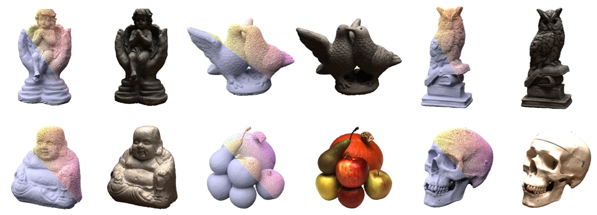

<div align="center">

  <h1 align="center">IMLS-Splatting: Efficient Mesh Reconstruction from Multi-view Images via Point Representation</h1>

</div>

<div align="center">

</div>

## Abstract
Multi-view mesh reconstruction has long been a challenging problem in graphics and computer vision. In contrast to recent volumetric rendering methods that generate meshes through post-processing, we propose an end-to-end mesh optimization approach called IMLS-Splatting. Our method leverages the sparsity and flexibility of point clouds to efficiently represent the underlying surface. To achieve this, we introduce a splatting-based differentiable Implicit Moving-Least Squares (IMLS) algorithm that enables the fast conversion of point clouds into SDFs and texture fields, optimizing both mesh reconstruction and rasterization. Additionally, the IMLS representation ensures that the reconstructed SDF and mesh maintain continuity and smoothness without the need for extra regularization. With this efficient pipeline, our method enables the reconstruction of highly detailed meshes in approximately 11 minutes, supporting high-quality rendering and achieving state-of-the-art reconstruction performance.

## Environment setup 
The code is tested under Python 3.7.13, CUDA 11.3, and PyTorch 1.12.1 .
```
git clone https://github.com/SilenKZYoung/IMLS-Splatting.git
cd IMLS-Splatting
conda env create --file environment.yml
```

## Dataset
Please download the NeRF-synthetic dataset from [here](https://drive.google.com/drive/folders/1cK3UDIJqKAAm7zyrxRYVFJ0BRMgrwhh4) and preprocessed DTU dataset by 2DGS from [here](https://drive.google.com/drive/folders/1SJFgt8qhQomHX55Q4xSvYE2C6-8tFll9).

## Launch
Run 3DGS initialization
```
cd gaussian-splatting
python train.py --eval --white_background --resolution 2 --expname $exp_name -s $data_path
```
Run IMLS-Splatting
```
cd ..
python train.py --eval --white_background --SSAA 1 --resolution 1 --expname $exp_name --meshscale $scene_scale  --start_checkpoint_ply $3DGS_ply_path  -s  $data_path     
```

## License
MIT License
